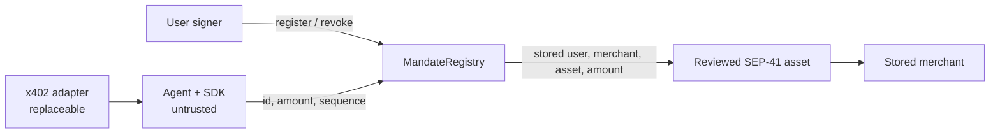
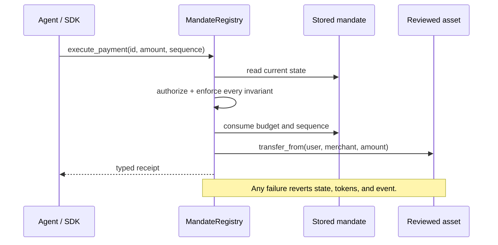
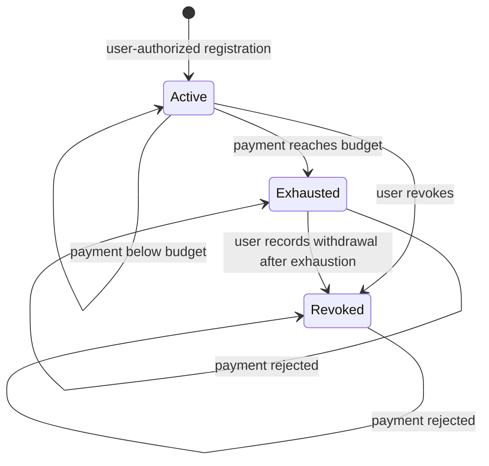

# Mainnet v2 MandateRegistry

## Status

`0.4.1` is ACKRATE's condensed MandateRegistry review candidate on `main`.
It is not deployed to Stellar mainnet. This directory has no deployment
configuration or runner, and `contracts/simple` remains unchanged.

V2 is one contract with one payment path. The contract—not the SDK, agent,
cache, x402 adapter, or merchant server—is the enforcement layer.

## 1,000-Agent Gate-Check Record

> [!IMPORTANT]
> **Latest completed cycle — cycle 4**
> Three release-gate issues found. Three fixed. State/accounting and Soroban
> host reviewers found no new contract-logic issue. The repaired revision passed
> 12,561 deterministic checks/actions, all 49 required tests, and direct
> execution of the exact optimized release file.

### Why this process is different

ACKRATE is treating agentic review as a cumulative engineering system, not a
one-time report. Independent agents attempt to break a fixed revision. A result
enters this record only after it is reproduced. Every confirmed issue is fixed
in code or in the release gate, converted into permanent regression evidence,
verified against the exact compiled contract, published to `main`, and attacked
again in the next round.

The differentiator is the closed loop and its public evidence: **discover →
reproduce → repair → lock the regression → execute the release bytes → publish
the result → repeat**.

| Campaign evidence | Current result |
|---|---:|
| Independent reviewers completed | 12 across 4 rounds |
| Executable contract checks/actions per full run | 12,561 |
| Required executable tests | 49 |
| Confirmed issues in the latest cycle | 3 found / 3 fixed |
| Release artifact exercised directly | Yes |

### Latest findings and repairs

| What the agents caught | What we fixed |
|---|---|
| A V2-looking release tag could publish an older contract family. | Release tags now pass through one unambiguous router. V2 release tags fail closed until a dedicated V2 release path is separately approved. |
| A required test could keep its name but be silently marked “ignored.” | Every required test is now executed even if it is marked ignored; names alone are not enough. |
| Different build machines produced different file fingerprints from the same source. | The release fingerprint is now defined by the pinned Linux release environment and Stellar CLI 27.0.0; local machines still verify behavior, size, and interface. |

<details>
<summary><strong>Cycle 3 fixes from 0.4.1</strong></summary>

| What the agents caught | What we fixed |
|---|---|
| Old and new data could be mistaken for the same version, creating a duplicate-spending risk after a bad upgrade. | Old data now stops safely before any mandate or money can be touched. |
| The release job was missing the Stellar build tool. | Clean release machines now install and verify the exact required tool. |
| The gate checked function names, but not the exact compiled contract file. | The exact file size and fingerprint are now locked. |
| Tests did not run the actual compiled file that would be shipped. | The gate now loads that exact file and proves sign-in, payment, rollback, state, and receipts. |
| Important tests could be removed without the gate noticing. | The gate now requires the complete 49-test list. |
| One callback test claimed more than it proved. | The claim now matches the proof: a hostile callback cannot spend twice or advance twice. |
| The state diagram missed one real user action. | The diagram and permanent test now match the contract. |

</details>

<details>
<summary><strong>Earlier fixes from 0.4.0</strong></summary>

| What the agents caught | What we fixed |
|---|---|
| A fake token could pretend a payment succeeded. | Only reviewed assets are accepted, and every receipt names the asset. |
| Another user could claim a public credential hash first. | Every mandate ID is bound to its network, contract, user, parties, asset, budget, and expiry. |
| One credential could create several budgets. | One user credential can create only one budget. |
| A mandate could outlive its storage window. | Mandates end within 30 days while active state targets roughly 120 days. |
| A bad administrator address could permanently receive control. | Control changes require proposal plus acceptance by the new administrator. |
| Payment receipts were missing asset and sequence. | Receipts now identify both. |
| Failed-payment checks did not prove every field rolled back. | Balance, budget, status, sequence, and receipts now roll back together. |
| Damaged or incompatible state could be read as valid. | State is validated before any settlement. |

</details>

The campaign scales through repeated independent rounds toward the 1,000-review
target. Counts above state completed work only; unconfirmed agent suggestions
are excluded.


## Contract in one view

The production contract is intentionally five files:

```text
mandate-registry/src/
├── lib.rs       # public API and complete enforcement path
├── storage.rs   # all storage keys, schema, and TTL policy
├── error.rs     # stable typed errors
├── types.rs     # durable mandate and identifier types
└── events.rs    # typed contract-spec events
```

Test-only hostile caller and callback contracts do not enter release WASM.
There is no timelock controller, upgrade queue, scheduler, cancellation path,
plugin hook, extension callback, or second payment function.



## The enforcement kernel

`execute_payment` is the only money-moving entry point. A successful call must
prove, in one Soroban invocation:

1. schema `2` is present and the contract is not paused;
2. the mandate exists and its stored agent authorizes the exact call;
3. the supplied sequence matches and can advance;
4. amount, stored status, spend, budget, and expiry are valid;
5. the stored asset is still approved and the stored merchant is used;
6. checked arithmetic keeps cumulative spend within budget;
7. updated spend, sequence, and status are written;
8. the reviewed SEP-41 asset transfers from the stored user to merchant; and
9. a typed payment receipt is emitted.

Any authorization, state, event, or token failure rolls back the whole
invocation. The caller cannot choose the user, merchant, asset, or agent during
settlement.



### Mandate state



Expiry is checked from ledger time on every validation and execution. It is not
stored as a mutable status.

## Public surface

| Area | Functions | Rule |
|---|---|---|
| Initialize | `__constructor` | Writes schema `2`, final administrator, running state, and first reviewed asset at fresh creation. |
| Mandates | `derive_mandate_id`, `register_mandate`, `get_mandate`, `validate_mandate`, `execute_payment`, `revoke_mandate` | User creates/revokes; agent executes; validation is advisory; execution always rechecks. |
| Emergency | `pause`, `unpause`, `is_paused` | Pause blocks the only money path; recovery and revocation remain available. |
| Assets | `set_asset_allowed`, `is_asset_allowed` | Administrator changes policy only while paused; removal blocks existing mandates. |
| Authority | `get_admin`, `get_pending_admin`, `propose_admin`, `accept_admin` | Two-step handoff prevents accidental loss of control. |
| Compatibility | `get_schema_version`, `upgrade` | Mandate methods reject non-current storage; same-address upgrades require administrator authorization and pause. |

There are exactly 18 exported functions and 9 typed event schemas. The gate
fails if either surface changes without an explicit reviewed update.

## Storage, identity, and trust boundaries

- `storage.rs` is the only production module that calls `env.storage()`.
- Schema `2` is deliberately incompatible with predecessor schema `1`; this
  blocks mixed-layout execution rather than guessing at a migration.
- One persistent entry holds each mandate. No caller-sized collection is
  stored or traversed.
- A mandate ID is the SHA-256 of an independently versioned domain plus network,
  registry, user, agent, merchant, asset, maximum, expiry, and credential hash.
- `UsedCredential(user, vc_hash)` prevents the same approval from producing
  multiple budgets.
- A mandate may live at most 30 days. Instance and persistent state are bumped
  toward a roughly 120-day target, clipped to the network maximum.
- The asset allowlist is a governance trust root. Production policy must admit
  only canonical, independently verified Stellar Asset Contract addresses.
- x402 wire types never enter storage or the public interface. Future x402
  adapters can change without redesigning the enforcement contract.

The SDK, adapters, caches, agents, UI, RPC provider, and merchant server are
untrusted. `validate_mandate` is only a preview; it cannot authorize or consume
anything. Settlement systems must verify network, registry, asset, mandate ID,
and sequence—not merely the presence of an event.

## Administration without a timelock

The contract has no timelock. `upgrade` calls Soroban's native same-address
WASM replacement only after current-administrator authorization and an
already-paused state.

Production policy is a native Stellar 2-of-3 account at the administrator
address. Deployment remains blocked until the authority record names all three
public signers, organizational holders, separate custody locations, rotation
steps, and one-key-loss recovery. Two lost keys have no hidden recovery path.

Version `0.4.1` is **fresh-create only**. It must be constructed at a new
contract address and must not be installed over schema `1` predecessor state.
The code also enforces this boundary: mandate reads, writes, and payments reject
any schema other than `2`. A future compatible upgrade must preserve schema
`2`; a future layout change requires an explicit migration and representative
old-state tests.

## Executable gate

From the repository root:

```bash
./scripts/gatecheck-contracts.sh
./scripts/security-scan.sh
```

The gate performs strict formatting and linting, runs every contract suite,
executes the V2 high-volume lane in the Soroban host, builds optimized
`wasm32v1-none`, checks the complete interface, and enforces the reviewed WASM
size/hash. The dependency policy rejects known vulnerabilities, yanked crates,
unexpected warnings, and accepted host-only code entering deployed WASM.

### Current V2 evidence

| Evidence | Current result |
|---|---:|
| Independent reviewers completed across four rounds | 12 |
| Amount/expiry boundary cases | 10,001 |
| Authenticated state-machine actions | 2,560 |
| Deterministic host cases/actions per full V2 gate | 12,561 |
| Executable tests | 48 native-host + 1 exact optimized-WASM smoke |
| Exported functions / typed events | 18 / 9 |

The tests use executable Soroban contract principals and a registered Stellar
Asset Contract for positive paths. V2 source contains no authorization-bypass
helper or dummy fixture. Continuous negative coverage includes unauthorized
callers, expired mandates, single and cumulative overspend, replay and ordering,
revocation, pause, asset and merchant binding, failed-transfer rollback,
predecessor/missing schema, hostile callers, callback attempts, unsafe upgrades,
event XDR, and TTL floors.

Exact artifact facts are updated only after the repaired gate completes:

| Artifact | Reviewed value |
|---|---|
| Optimized WASM size | 15,405 bytes |
| Canonical Linux WASM SHA-256 | `acf5a71b86ad0d92f4f1249f827838e70a3bee5b5e56e6d2e50f047670037fc1` |
| Canonical full-interface SHA-256 | `69c201ce1fb089ccfef06f125826b0aeba72af1b1536cb0b19e8cb05970ee805` |

## Remaining release blockers

Passing tests cannot prove the absence of unknown defects. Before any V2
mainnet action, all of these remain mandatory:

- finish repeated independent review, property/fuzz, mutation, differential,
  and resource-cost lanes;
- complete and rehearse the named 2-of-3 custody and recovery record;
- verify reference apps teach mandate registration plus authoritative on-chain
  execution and warn against agent token allowances or cached approval; and
- run testnet drills for rogue-agent spending within budget, merchant downtime
  after settlement, and mid-flow expiry, preserving transaction evidence and
  user-visible outcomes.

No claim of perfection, immutability, or readiness for billion-dollar custody
is made by this candidate.

## Primary Stellar references

- [Contract authorization](https://developers.stellar.org/docs/build/guides/auth/contract-authorization)
- [Storage strategies](https://developers.stellar.org/docs/build/guides/storage/storage-strategies)
- [Storage migration](https://developers.stellar.org/docs/build/guides/storage/migrate-contract-storage)
- [Typed events](https://developers.stellar.org/docs/build/smart-contracts/example-contracts/events)
- [Same-address upgrades](https://developers.stellar.org/docs/build/guides/conventions/upgrading-contracts)
- [Cost and size analysis](https://developers.stellar.org/docs/build/guides/fees/analyzing-smart-contract-cost)
- [Differential testing](https://developers.stellar.org/docs/build/guides/testing/differential-tests)
- [Fuzz testing](https://developers.stellar.org/docs/build/guides/testing/fuzzing)

## Deployment boundary

This work performs no Stellar upload, install, invoke, deployment, or live-state
mutation. Any future deployment is a separate, explicitly authorized release.
