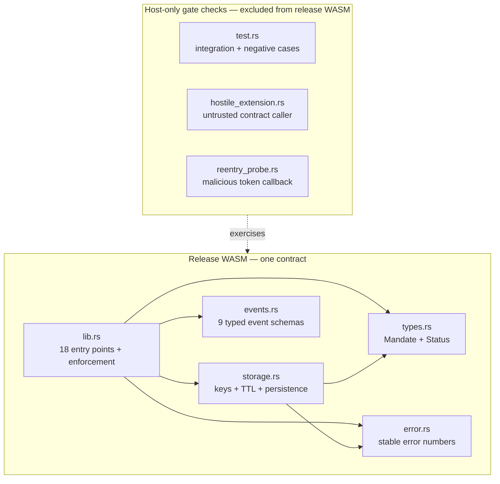
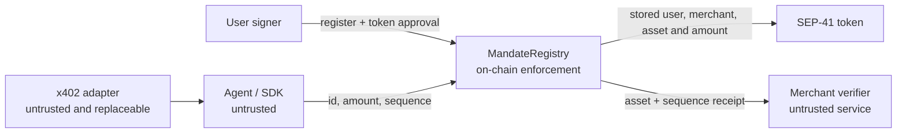
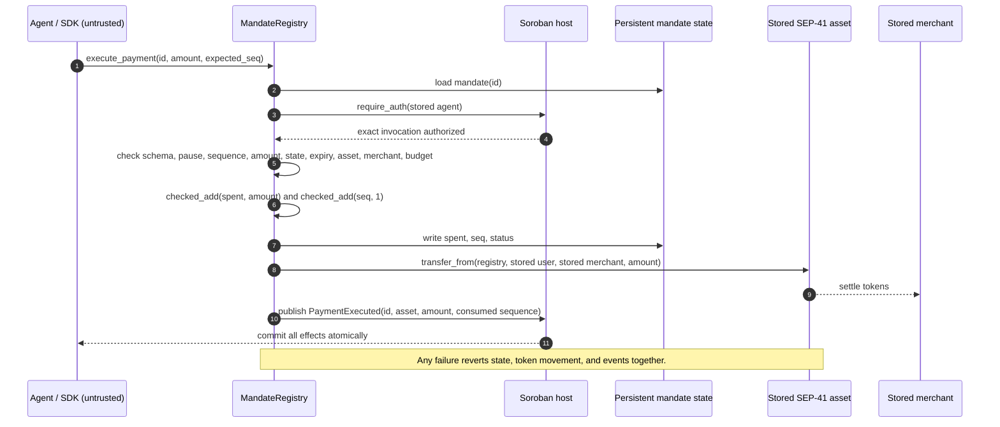
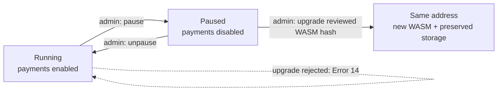
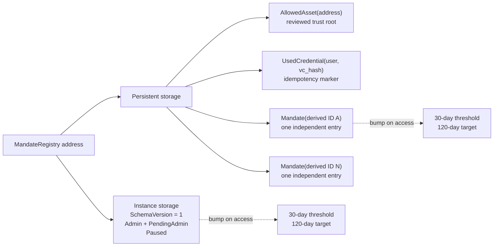

# Mainnet v2 MandateRegistry

## Status

This is the condensed `0.4.0` review candidate for ACKRATE's next
MandateRegistry. It is maintained on `main` for inspection and hardening. It has **not** been deployed
to Stellar mainnet, and this directory contains no deployment configuration,
deployment manifest, or deployment runner.

The existing `contracts/simple` implementation remains unchanged. Mainnet v2
starts from its tested behavior, modernizes the Soroban SDK and event surface,
and removes duplicate wrapper modules without adding a second contract.

## Design thesis

The differentiator is not code volume. It is a small, explicit enforcement
kernel that removes common bypass paths from the public interface:

- one contract;
- one money-moving function;
- one storage module;
- one stored source of truth per mandate;
- one authorization boundary per privileged role; and
- no dependency on SDK honesty, cached preflight state, x402 wire shape, or an
  off-chain policy engine.

The design follows current Stellar practice: `#![no_std]`, typed contract data,
host-managed authorization, fine-grained persistent entries, explicit TTL
management, checked arithmetic, typed events, exact dependency pins, optimized
`wasm32v1-none` output, and tests that run inside the Soroban host.

## What changed from `contracts/simple`

`contracts/simple` remains byte-for-byte untouched. V2 is a separate review
target on `main`.

| Area | Source contract | Mainnet v2 |
|---|---|---|
| Deployable contracts | MandateRegistry | MandateRegistry only |
| Production source files | Eight | Five |
| Public functions | 16 | 18 |
| Payment routes | One | One |
| Upgrade flow | Internal schedule/cancel/delay/execute state | Immediate same-address upgrade, admin-authorized and only while paused |
| Event encoding | Manual topics/data | Nine typed `#[contractevent]` schemas in the contract spec |
| Storage versioning | No explicit marker | Constructor writes schema version `1` |
| Asset admission | Any caller-selected address | Administrator-reviewed allowlist; changes require pause |
| Identifier | Caller-selected global key | Network/registry/user/terms-domain hash plus user-scoped credential-use marker |
| Mandate lifetime | Any future timestamp | Maximum 30 days, below the persistence target |
| Admin handoff | Immediate one-step replacement | Recoverable proposal plus candidate-authorized acceptance |
| Missing pause state | Defaults to running | Fails closed as paused |
| Active-state TTL policy | Approx. 1-day threshold / 30-day extension | Approx. 30-day threshold / 120-day extension |
| Soroban SDK | `22.0.11` | Exactly `26.1.0` |
| Positive-path authorization tests | Test authorization overrides | Real nested calls from contract principals |

The refactor folds the former `admin.rs`, `registry.rs`, and `payment.rs`
behavior into `lib.rs`, where reviewers can read the complete authorization and
money path without hopping between tiny wrapper modules. Durable boundaries
remain isolated: storage layout, error numbers, stored/interface types, and
event schemas.

## One contract, five production files

`mainnet-v2` contains one deployable contract: `mandate-registry`.

```text
contracts/mainnet-v2/
├── README.md
└── mandate-registry/
    ├── Cargo.toml
    ├── Cargo.lock
    └── src/
        ├── lib.rs       # public API and all enforcement logic
        ├── storage.rs   # the only module allowed to touch contract storage
        ├── error.rs     # stable typed contract errors
        ├── types.rs     # durable stored/interface types
        └── events.rs    # typed, contract-spec-visible events
```

Test-only gate contracts remain separate so none of their code enters the
release WASM:

- `test.rs` — integration, authorization, state-machine, and negative cases;
- `hostile_extension.rs` — hostile caller/extension attempts; and
- `reentry_probe.rs` — malicious token callback attempt.

There is no timelock controller, delayed-operation queue, pending-upgrade
record, scheduler, cancellation method, or timelock dependency. Mainnet v2
contains only MandateRegistry.



## Enforcement invariants

The contract is designed around one money-moving entry point,
`execute_payment`. Every successful payment must satisfy all of these
conditions in the same Soroban invocation:

1. The contract is not paused.
2. The stored mandate exists.
3. The mandate-bound agent authorizes the exact invocation.
4. `expected_seq` equals the stored monotonic sequence.
5. The stored schema and numeric/status invariants are valid.
6. The amount is strictly positive.
7. The mandate is active and not expired.
8. The stored asset remains administrator-approved.
9. The merchant is the exact stored merchant.
10. Checked arithmetic proves the new cumulative spend does not overflow and
   does not exceed the stored budget.
11. Checked arithmetic proves the sequence can advance.
12. The updated `spent`, `seq`, and status are written before the token call.
13. The contract executes SEP-41 `transfer_from` from the mandate user to the
    stored merchant using the stored asset.

Soroban rolls back the entire invocation if authorization, storage, event
publication, or token settlement fails. There is no partial state consumption,
second payment route, extension callback, plugin hook, or caller-selected
merchant/asset in the settlement method.

### Mandate state machine

```mermaid
stateDiagram-v2
    [*] --> Active: user-authorized registration
    Active --> Active: payment below remaining budget\nspent += amount; seq += 1
    Active --> Exhausted: payment reaches max_amount\nspent = max_amount; seq += 1
    Active --> Revoked: user-authorized revocation
    Revoked --> Revoked: future payment rejected
    Exhausted --> Exhausted: future payment rejected
```



Expiry is checked against the current ledger-close timestamp on every
validation and execution. It is not written as a fourth status, so time cannot
silently mutate storage and an expired mandate can never become active again.

## x402 and SDK trust boundary

x402 v0.1 is an evolving off-chain transport. No x402 request, response,
header, proof, or authentication-flow type appears in contract storage or the
contract interface. An adapter may translate x402 v0.2 or v0.3 into the stable
on-chain inputs without changing MandateRegistry.

The SDK, adapters, agents, merchant server, UI, cache, database, and RPC
provider are untrusted conveniences. `validate_mandate` is advisory only. A
caller cannot skip enforcement by caching a prior result because
`execute_payment` re-reads the mandate and repeats every authoritative check in
the same invocation that consumes state and transfers value.



The security boundary is the registry invocation, not the HTTP exchange or an
SDK method call.

### Atomic payment sequence



The caller supplies only the mandate ID, amount, and expected sequence. The
contract obtains the agent, user, merchant, asset, cumulative spend, expiry,
and status from persistent state at execution time.

## Public interface

### Initialization

| Function | Authorization | Purpose |
|---|---|---|
| `__constructor(admin, initial_asset)` | Deployment-time only | Atomically write schema version `1`, administrator, `Paused = false`, and the first reviewed asset. |

Soroban constructors execute once when the contract instance is created and do
not rerun during a WASM upgrade. The deployment transaction must therefore
supply the final reviewed administrator and canonical Stellar Asset Contract
address; there is no compiled-in key, token address, or fallback authority.
This breaking `0.4.0` revision is fresh-deploy-only: no earlier v2 instance was
deployed, and constructors do not run during upgrades.

### Administration and emergency response

| Function | Authorization | Purpose |
|---|---|---|
| `get_admin` | None | Read the current administrator. |
| `get_pending_admin` | None | Read the current handoff candidate, if any. |
| `propose_admin` | Current administrator | Propose or replace a recoverable handoff candidate. |
| `accept_admin` | Proposed administrator | Prove control and finalize the handoff. |
| `pause` | Current administrator | Stop the only money-moving method. |
| `unpause` | Current administrator | Restore payment execution. |
| `is_paused` | None | Read emergency-stop state. |
| `set_asset_allowed` | Current administrator; contract paused | Add or remove a reviewed settlement asset. Removal blocks existing mandates using it. |
| `is_asset_allowed` | None | Read current asset admission. |
| `get_schema_version` | None | Read the storage schema or fail closed if it is missing. |

Pause and unpause are idempotent. Registration, reads, revocation, and
administrative recovery remain available while payments are paused. Preview
validation deliberately returns `Paused` so it agrees with the non-auth checks
of the money path.

### Same-address upgrade

| Function | Authorization | Purpose |
|---|---|---|
| `upgrade` | Current administrator | Replace WASM at the same address, but only while payments are already paused. |

The contract has no timelock. It calls Soroban's native
`update_current_contract_wasm` only after administrator authorization and the
pause check. Any host failure rolls the invocation back. The contract address
and compatible storage survive a successful WASM replacement. Constructors do
not rerun after an upgrade.



The pause requirement is an on-chain invariant, not an operating suggestion.
It prevents an administrator from replacing live payment logic without first
entering the observable emergency state.

### Governance custody without a timelock

The administrator is one Soroban `Address`; production policy is to use a
native Stellar 2-of-3 account at that address. The contract does not implement
key custody and must never receive private keys or recovery phrases.

The future v2 deployment is blocked until its authority record identifies all
three public signer addresses, the named organizational holder of each key,
independent custody locations, and the final 2-of-3 thresholds. Those facts are
not known for this undeployed baseline and are deliberately not invented here.

- Normal action: signer one prepares the exact transaction; signer two
  independently verifies network, contract, function, arguments, and hash
  before co-signing.
- Rotation: pause payments; use two current signers to replace the affected
  signer without lowering thresholds; independently verify all three public
  signers and every 2-of-3 pair; then unpause.
- One key lost: the remaining two signers replace it. The lost signer is never
  reused.
- Two keys lost: there is no hidden or unilateral recovery path. Keep payments
  paused and perform a separately reviewed protocol migration.
- Suspected compromise: pause, publish an incident record, rotate with the
  unaffected quorum, verify authority and contract state, then unpause.

Removing the timelock makes multisig custody, independent transaction review,
and continuous public monitoring mandatory operational controls. This is an
explicit design tradeoff, not a claim that upgrades are delay-protected.

### Mandate lifecycle and settlement

| Function | Authorization | Purpose |
|---|---|---|
| `derive_mandate_id` | None | Derive the canonical network/registry/user/terms-bound ID without depending on x402 wire shape. |
| `register_mandate` | Mandate user | Admit a reviewed asset and ≤30-day lifetime, consume the user-scoped credential commitment once, derive the ID, and initialize mutable state internally. |
| `validate_mandate` | None | Non-value-moving preview of pause, sequence, asset, merchant, amount, state, expiry, and budget checks. |
| `execute_payment` | Mandate agent | Atomically consume sequence/budget and execute the token transfer. |
| `revoke_mandate` | Mandate user | Permanently withdraw consent for future spends. |
| `get_mandate` | None | Read the stored mandate and refresh its persistence horizon when needed. |

`validate_mandate` is advisory. `execute_payment` repeats every authoritative
check and never trusts an SDK or earlier simulation.

## Storage model

`storage.rs` is the only production file that calls `env.storage()`.

- Bounded global state (`SchemaVersion`, `Admin`, `PendingAdmin`, and `Paused`) uses instance
  storage because it is small and required across contract invocations. The
  constructor writes schema version `1`; value-moving and mandate methods reject
  missing or unexpected schema state.
- Reviewed-asset entries and user-scoped credential-use markers use persistent
  storage. The marker prevents one user from turning the same credential
  commitment into multiple budgets with altered terms.
- Each mandate uses a separate persistent entry keyed by a canonical SHA-256 of
  immutable terms, network ID, registry address, user, and an independently
  versioned identifier domain.
  This keeps lookups O(1), avoids unbounded collections, and allows independent
  archival/restoration footprints.
- Active instance/code and mandate entries use bump-on-access TTL management:
  when fewer than approximately 30 days remain, TTL is extended to
  approximately 120 days.
- Registration permits at most 30 days of mandate lifetime, below the
  approximately 120-day persistence target. TTL targets are clipped to the
  network maximum. Mandate expiry is enforced from the stored ledger-close timestamp. TTL
  is a rent/availability policy, never the authorization boundary.



No `Vec`, `Map`, or caller-sized collection is stored or traversed. Each
payment touches the small global instance plus one mandate entry, keeping work
bounded and avoiding a shared on-chain list of mandates.

The stored `Mandate`, `Status`, and `DataKey` shapes are
compatibility-sensitive. A future field or layout change requires an explicit
versioned migration and a test that reads representative old state.

## Authorization and error model

Soroban addresses may be classic accounts or contract accounts. The contract
uses host-managed `Address::require_auth()` at every privileged or value-moving
entry point:

- user authorization registers and revokes consent;
- agent authorization consumes a mandate and initiates settlement; and
- current-admin authorization controls pause, proposals, asset policy, and upgrades;
- proposed-admin authorization accepts an authority handoff.

Authorization failures are host-level transaction failures. Expected business
failures use explicit `#[contracterror]` values so clients and other contracts
can handle them deterministically. Existing numeric error assignments remain
stable.

| Code | Error | Meaning |
|---:|---|---|
| 1 | `AlreadyExists` | The mandate ID is already registered. |
| 2 | `NotFound` | The mandate ID does not exist. |
| 3 | Reserved | Former authorization slot; authorization is host-enforced. |
| 4 | `MandateExpired` | Registration expiry is invalid or execution time reached expiry. |
| 5 | `MandateRevoked` | User consent was withdrawn. |
| 6 | `BudgetExceeded` | Status is exhausted, arithmetic overflowed, or cumulative spend exceeds the cap. |
| 7 | `MerchantOutOfScope` | Validation requested a merchant other than the stored merchant. |
| 8 | `BadSequence` | Sequence is stale or future. |
| 9 | `InvalidAmount` | Amount or maximum amount is not strictly positive. |
| 10 | `Paused` | The sole money path is stopped. |
| 11–13 | Reserved | Removed delayed-upgrade errors; numbers cannot be silently reused. |
| 14 | `UpgradeRequiresPause` | Upgrade was attempted while payments were enabled. |
| 15 | `AssetNotAllowed` | Registration, preview, or execution names an asset outside reviewed policy. |
| 16 | `MandateTooLong` | Requested lifetime exceeds 30 days. |
| 17 | `SequenceExhausted` | The monotonic sequence cannot advance. |
| 18 | `AssetPolicyRequiresPause` | Asset policy was changed while payments were enabled. |
| 19 | `InvalidState` | Schema or stored mandate invariants fail closed. |
| 20 | `NoPendingAdmin` | No administrator candidate can accept a handoff. |
| 21 | `AssetOutOfScope` | Preview supplied an asset other than the stored asset. |

## Events

All application events use current `#[contractevent]` types so event schemas
are exported in the contract specification. Stable typed events cover
administrator changes, pause state, successful upgrades, registration,
payment, and revocation. Failed invocations publish no surviving events.

| Event type | Indexed topics | Data | Published only after |
|---|---|---|---|
| `AdminTransferProposed` | `admin_pending` | Candidate administrator | Current-admin authorization and recoverable proposal write |
| `AdminSet` | `admin` | New administrator | Candidate authorization and completed handoff |
| `AssetPolicyChanged` | `asset_policy`, asset | Allowed flag | Admin authorization, pause check, and policy write |
| `Paused` | `paused`, administrator | `()` | Transition from running to paused |
| `Unpaused` | `unpaused`, administrator | `()` | Transition from paused to running |
| `Upgraded` | `upgrade`, administrator | New WASM hash | Admin authorization and pause check |
| `MandateRegistered` | `register`, user | Mandate ID | User authorization and persistent write |
| `PaymentExecuted` | `payment`, merchant, asset | Mandate ID, amount, consumed sequence | State consumption and successful call to the reviewed asset |
| `MandateRevoked` | `revoke` | Mandate ID | User authorization and persistent write |

## Build profile and dependency policy

- `soroban-sdk` is pinned exactly to `26.1.0`, matching the repository's current
  mainnet generation instead of accepting an unreviewed semver update.
- Contract-spec shaking is enabled for a smaller release interface.
- The release profile uses size optimization, LTO, one codegen unit, stripped
  symbols, disabled debug assertions, checked overflow, and aborting panics.
- Production code has no dependency beyond the Soroban SDK.
- The lockfile is committed and every gate runs with `--locked`.

## Stellar feedback traceability

| Feedback | V2 implementation | Gate-check evidence |
|---|---|---|
| x402 will evolve | No x402 wire/request/response type crosses the contract boundary; adapters remain replaceable. | Exact 18-function interface check |
| MandateRegistry is the enforcement layer | `execute_payment` re-reads state and atomically validates, consumes, transfers, and emits. | Happy path, rollback, hostile-extension, and callback tests |
| Negative cases must run continuously | Unauthorized caller, expiry, overspend, replay, and unsafe-upgrade cases are required by name in the repository gate. | CI invokes `gatecheck-contracts.sh` on every push and pull request |
| The SDK is untrusted | A cached `validate_mandate` result cannot authorize or consume; only `execute_payment` moves value. | Direct-caller rejection and state-change tests |
| Upgrade risk is a release gate | Upgrade requires current-admin authorization and an already-paused contract. Storage preservation is tested at the same address. | Unauthorized, unpaused, and successful replacement tests |
| Multisig ownership and recovery must be documented | The intended 2-of-3 custody workflow and loss/rotation paths are explicit; unknown holder identities remain deployment blockers. | Pre-mainnet authority record required below |
| Reference apps must teach the safe path | Safe and unsafe integration patterns are defined as release deliverables, outside this contract repository. | Pre-mainnet reference-app review required below |
| Live failure modes need drills | Rogue-agent, merchant-downtime, and mid-flow-expiry drills are named release blockers. | Testnet transaction evidence required below |

The requested no-timelock decision is reflected directly: V2 has no delay,
queue, scheduler, cancellation, or pending-upgrade storage. The compensating
controls are paused-only upgrades, intended 2-of-3 account custody, independent
transaction verification, continuous monitoring, and explicit release gates.

## Gate check iteration log

This append-only log records confirmed findings, the exact fixes applied, and
the executable evidence added. Independent reviewers are useful discovery
tools; a passing review round is not proof that unknown defects do not exist.

### Iteration `0.4.0` — independent review rounds 1 and 2

Three independent reviewers examined the pushed `0.3.0` baseline, then three
fresh reviewers examined the repaired local revision. Consensus findings were
deduplicated before implementation.

| Confirmed finding | Impact | Contract change | Permanent regression evidence |
|---|---|---|---|
| Any caller-selected token contract could return success without transferring value. | A successful-looking receipt could be created for an unreviewed asset. | Constructor admits one reviewed asset; paused admin policy controls additions/removals; preview and execution reject removed assets; receipt includes asset. | `reviewed_asset_policy_is_enforced_on_registration_and_execution`; registered-SAC balance assertions; callback probe |
| A global caller-selected `vc_hash` key could be claimed by another user. | Public or observed identifiers could be squatted, denying intended registration. | Mandate IDs are derived from network, registry, user, all immutable terms, and credential commitment. | `mandate_identifier_is_bound_to_network_registry_user_and_terms` plus fixed known-answer vector |
| The same user credential commitment could create multiple budgets by changing a term. | Credential-level idempotency could be bypassed. | `UsedCredential(user, vc_hash)` is consumed atomically with registration. | `credential_commitment_is_idempotent_across_changed_terms` |
| Arbitrary future expiry could outlive the storage target. | A nominally active mandate could hit an archival/restoration cliff. | Lifetime is capped at 30 days; persistent state targets approximately 120 days and clips to the network maximum. | `mandate_lifetime_is_bounded_below_persistence_target`; TTL floor test |
| Immediate administrator replacement could strand control after a typo or unusable address. | Pause, policy, and upgrade authority could be lost. | `propose_admin` leaves the old administrator active; only the candidate can `accept_admin`; a proposal can be replaced before acceptance. | `admin_rotation_transfers_control`; authorization suite |
| Payment events omitted asset and consumed sequence. | Equal-amount payments were ambiguous to fulfillment/indexing systems. | `PaymentExecuted` now binds merchant and asset topics plus mandate ID, amount, and consumed sequence data. | typed XDR event-shape test and exact event gate |
| Token-call rollback checks covered balance but not all mandate fields or exact-budget exhaustion. | A regression could consume sequence/status on a failed transfer. | No money-path change was required; the suite now asserts atomic state rollback and same-sequence retry. | `insufficient_allowance_blocks_payment`; `exact_budget_token_failure_rolls_back_exhaustion` |
| Stored schema and numeric/status invariants were written but not enforced. | An incompatible future migration could fail open. | Mandate methods require schema `1`; invalid stored invariants return `InvalidState`. | missing-schema/pause and invalid-state cases |
| Error codes 11–13 and ID format versioning could drift during the repair. | Existing decoders or historical IDs could be reinterpreted. | Codes 11–13 stay reserved; ID-domain version is independent from storage schema. | exact error table, interface gate, fixed ID vector |

The high-volume deterministic lane adds 10,001 amount/expiry boundary cases and
2,560 authenticated registration/payment/rejection actions using executable
Soroban contract principals and a registered Stellar Asset Contract. No
authorization-bypass test API is used in the v2 suite.

The asset allowlist is a governance trust root, not a way to prove arbitrary
token semantics. Deployment must admit only canonical, independently verified
Stellar Asset Contract addresses. A `PaymentExecuted` event proves the registry
committed a call to the admitted asset; merchant settlement systems must also
verify the expected network, registry, asset, mandate ID, and sequence.

## Current baseline gate

Run from the repository root:

```bash
./scripts/gatecheck-contracts.sh
./scripts/security-scan.sh
```

The contract gate formats, lints with warnings denied, runs all tests, and
builds optimized `wasm32v1-none` release WASM. The security scan rejects known
dependency vulnerabilities, yanked crates, unexpected gate-check warnings, and
any accepted host-only advisory entering the deployed WASM dependency graph.

| Baseline artifact fact | Result |
|---|---|
| Optimized WASM size | 15,405 bytes |
| WASM SHA-256 | `1ec385a9378d0605275a5993c767660fd8a63c887b27be40149e16838f27c780` |
| Canonical full-interface SHA-256 | `69c201ce1fb089ccfef06f125826b0aeba72af1b1536cb0b19e8cb05970ee805` |
| Exported functions | 18, exact-name checked |
| Typed event schemas | 9, exact-name checked |
| V2 host tests | 46 passing, including 12,561 deterministic cases/actions |

The 46-test behavior suite includes real Soroban host execution, real nested
contract-principal authorization, and a registered Stellar Asset Contract. It
covers authorization failures, pause boundaries, upgrade
authorization/pause/storage preservation, replay and ordering,
single/cumulative overspend, expiry, revocation, merchant/asset binding,
allowance failure rollback, hostile contract callers, a malicious callback
attempt, contract-account authorization, typed event XDR, and
instance/per-mandate TTL floors.

The Tranche 3 negative cases are continuous gates now, not future work:

| Stellar feedback case | Continuous test evidence |
|---|---|
| Unauthorized callers | `register_requires_user_auth`, `execute_requires_agent_auth`, `revoke_requires_user_auth`, `admin_methods_require_authorization`, `direct_caller_cannot_bypass_a_contract_agent` |
| Expired mandates | `expired_mandate_rejected`, `register_with_past_expiry_rejected`, hostile-extension expiry case |
| Overspend | `overspend_single_rejected`, `overspend_cumulative_rejected`, `exhausted_status_then_rejected` |
| Replay / out-of-order execution | `replay_stale_seq_rejected`, `out_of_order_seq_rejected` |
| Unauthorized or unsafe upgrade | `admin_methods_require_authorization`, `upgrade_requires_pause_without_changing_state`, `paused_admin_upgrade_replaces_wasm_at_same_address_and_preserves_storage` |

CI runs these on every push and pull request. Removing the tests, removing the
v2 crate from the gate, adding a timelock-controller directory, or introducing
a vulnerable/yanked deployed dependency fails the repository gate.

## Threat model and pre-mainnet release blockers

This review baseline is not described as immutable, independently gate-checked,
bulletproof, or ready to custody billions. Before any v2 mainnet release, the
following are gating deliverables rather than closing documentation:

- update the threat model and data-flow review for every interface, storage,
  authority, asset-policy, or payment-path change;
- complete the named 2-of-3 holder/custody record and rehearse rotation plus
  one-key-loss recovery;
- complete property/fuzz, mutation, differential, resource-cost, and repeated
  independent adversarial review;
- verify the reference consumer and fulfillment agents teach the safe pattern:
  user-authorized mandate, allowance only to MandateRegistry, untrusted
  `validate_mandate` preflight, and authoritative on-chain execution;
- make those examples explicitly reject unsafe patterns such as granting an
  agent a token allowance, trusting cached mandate state, or treating an x402
  proof as settlement authority; and
- run testnet drills for a rogue agent staying within its finite budget,
  merchant downtime after settlement with idempotent fulfillment recovery, and
  expiry during the request flow. Record the transaction evidence and the
  user-visible result for each drill.

The SDK/reference-agent and live-testnet work occurs in their owning
repositories and requires separate authorization; this contract repository
records it as release evidence. No such drill or deployment is performed by
this baseline change.

The next phase, after review of this baseline, is deliberately separate:
property/fuzz testing, mutation testing, differential tests against the source
contract, broader invariant review, resource-cost analysis, and repeated
adversarial gate checks. Findings from that phase will be fixed and rerun
before any release decision.

## Primary design references

The implementation decisions above were checked against current primary
Stellar and OpenZeppelin material:

- [Stellar contract authorization](https://developers.stellar.org/docs/build/guides/auth/contract-authorization)
- [Stellar production storage strategies](https://developers.stellar.org/docs/build/guides/storage/storage-strategies)
- [Choosing a Stellar storage type](https://developers.stellar.org/docs/build/guides/storage/choosing-the-right-storage)
- [Stellar storage migration guidance](https://developers.stellar.org/docs/build/guides/storage/migrate-contract-storage)
- [Typed Soroban contract events](https://developers.stellar.org/docs/build/smart-contracts/example-contracts/events)
- [Stellar same-address WASM upgrades](https://developers.stellar.org/docs/build/guides/conventions/upgrading-contracts)
- [Typed Soroban contract errors](https://developers.stellar.org/docs/build/smart-contracts/example-contracts/errors)
- [Stellar contract cost and size analysis](https://developers.stellar.org/docs/build/guides/fees/analyzing-smart-contract-cost)
- [Stellar differential testing](https://developers.stellar.org/docs/build/guides/testing/differential-tests)
- [Stellar fuzz testing](https://developers.stellar.org/docs/build/guides/testing/fuzzing)
- [OpenZeppelin Stellar upgrade and migration guidance](https://docs.openzeppelin.com/stellar-contracts/utils/upgradeable)
- [OpenZeppelin Stellar Contracts architecture](https://github.com/OpenZeppelin/stellar-contracts/blob/main/Architecture.md)

Official example repositories explicitly warn that educational examples are
not proof of production security. This contract treats them as API/convention
references only.

## Deployment boundary

This baseline performs no Stellar mainnet deployment, upload, install, invoke,
or live-state mutation. A future deployment requires a separately reviewed
artifact/release process and explicit authorization outside this refactor.
