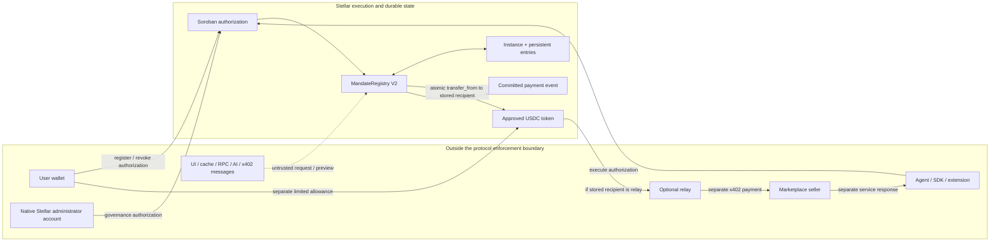
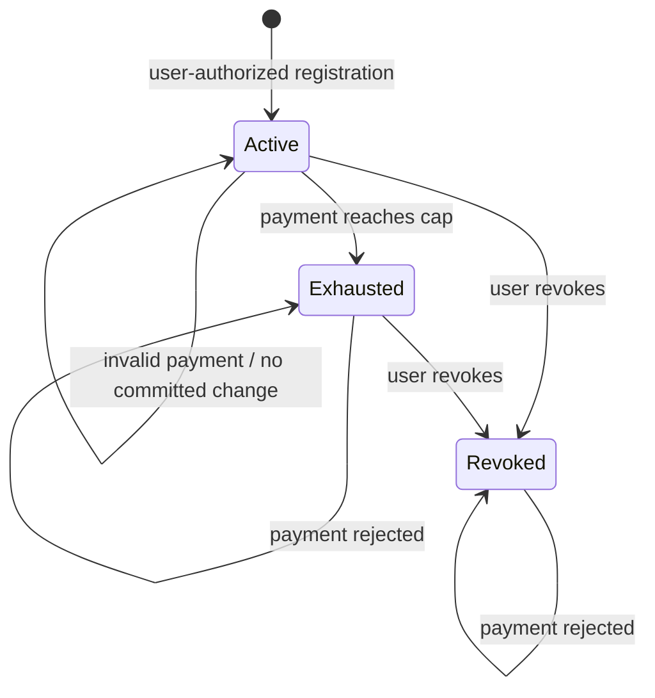
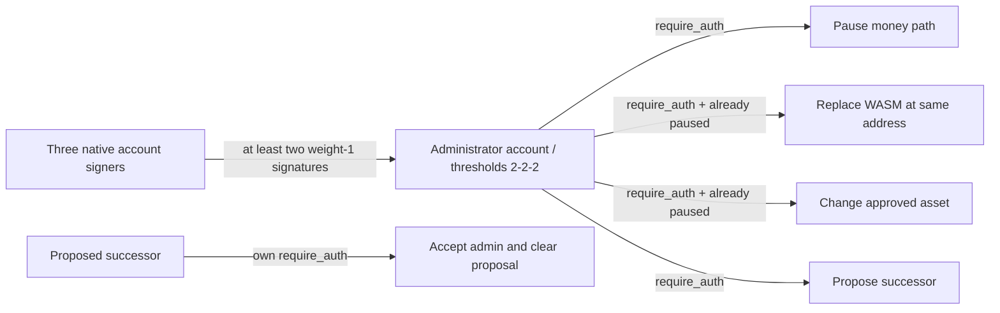

# Mainnet V2 data flow and trust boundaries

**Reviewed:** 2026-09-07 (Bangkok, UTC+7). Scope is the
[deployed V2 contract](mainnet-v2-security-verification.md#exact-mainnet-target),
not the historical two-contract canary. See the
[threat model](mainnet-v2-threat-model.md) for controls and residual risks.

## System boundary



All arrows entering the registry from off-chain systems are requests, not trusted
validation results. The token-transfer recipient is fixed in the mandate. In a
relay-backed purchase, the second transfer and service response are outside the
registry transaction. RPC/indexer receipt displays are not independent proof
unless checked against confirmed chain state and the actual token event.

## Data entities and authority

| Entity / storage key | Contents and source | Who can change it / enforcement |
|---|---|---|
| `SchemaVersion` (instance) | Current layout marker `2` from construction | Future implementation/migration only; mandate paths reject other values |
| `Admin` (instance) | Administrator address | Constructor initializes; proposed successor authorizes `accept_admin` |
| `PendingAdmin` (instance) | Optional successor address | Current administrator proposes/replaces; successor acceptance clears |
| `Paused` (instance) | Money-path stop flag | Current administrator; missing flag is treated as paused |
| `AllowedAsset(asset)` (persistent) | Approved token address | Constructor admits initial asset; administrator changes only while paused; missing/removed means false |
| `Mandate(id)` (persistent) | User, agent, recipient, asset, maximum amount, spent, expiry, sequence, status, credential commitment | User-authorized registration; agent-authorized atomic execution advances spent/sequence/status; user-authorized revocation sets Revoked |
| `UsedCredential(user, vc_hash)` (persistent) | Per-user duplicate-registration marker | Created atomically with capped TTL; duplicate reuse rejected while retained. Rejected registration rolls back any attempted refresh; successful payments/mandate reads do not renew this separate marker |
| Mandate ID | SHA-256 of XDR: domain version, network, registry, user, agent, recipient, asset, budget, expiry, commitment | Deterministic derivation; public preview alone creates no stored authority |
| Token allowance (USDC contract, not registry storage) | Owner, registry spender, maximum allowance and token expiration ledger | Token-owner authorization; token contract enforces at transfer time |
| Token balance (USDC contract) | User and stored recipient balances | Token contract transfer rules, in the same transaction as registry consumption |
| Typed events | Registration, payment, revocation, pause/unpause, policy, proposal/acceptance, upgrade | Emitted by successful paths; rolled back with failed transactions; not a substitute for current state |
| x402 challenge and service payload (off-chain) | Seller, price, protocol fields, request inputs, content and sources | Untrusted application data; never read by MandateRegistry; version adaptation stays outside contract mandate logic |
| Shared report / saved receipt (off-chain) | Displayed content and transaction references | App/database-controlled copy; does not authorize spending or prove merchant delivery |

Amounts are token base units, not floating-point currency. Expiry uses ledger
timestamp; token allowance expiration and storage TTL use ledger counts. These
three lifetimes must not be conflated.

## Registration and allowance

```mermaid
sequenceDiagram
    participant User
    participant Registry
    participant State
    participant USDC
    User->>Registry: register_mandate(terms), user authorization
    Registry->>Registry: schema, auth, budget, expiry, asset, unique commitment + ID
    Registry->>State: Active, spent=0, seq=0; record credential marker
    Registry-->>User: mandate ID and registration event
    User->>USDC: approve(registry, amount, expiration ledger), token authorization
    USDC-->>User: allowance confirmation
    Note over Registry,USDC: Separate transactions; registration does not transfer funds or create token allowance
```

Registration, reads, and revocation remain available while paused. Pending
allowance confirmation must not be represented by the UI as confirmed spending
authority; the token still checks actual allowance when a payment executes.

## Payment and rollback

```mermaid
sequenceDiagram
    participant Agent
    participant Registry
    participant State
    participant USDC
    participant Recipient
    Agent->>Registry: optional validate_mandate(id, amount, seq, recipient, asset)
    Registry-->>Agent: non-binding preview
    Agent->>Registry: execute_payment(id, amount, expected_seq)
    Registry->>Registry: schema 2 and not paused
    Registry->>State: load stored mandate
    Registry->>Registry: stored agent auth; sequence; valid state; expiry; amount; budget; asset
    Registry->>State: spent + amount, seq + 1, Exhausted if exact cap
    Registry->>USDC: transfer_from(registry, stored user, stored recipient, amount)
    USDC->>Recipient: transfer under actual token allowance and balance rules
    Registry-->>Agent: PaymentExecuted with consumed sequence
    Note over Registry,Recipient: Failure at any point rolls back consumption, token movement, and event
```

Execution does not accept a caller-selected asset or recipient. Public validation
cannot reserve sequence/budget and cannot bypass later checks. Concurrent requests
with the same expected sequence cannot both commit successfully against that state.

## Lifecycle, pause, and retention



Expiry is a checked condition, not an additional persisted status. An expired
Active entry cannot pay. Pause and asset-policy removal also block existing
mandates without rewriting their status. Revocation does not erase history,
transfer funds, or automatically clear the separate token allowance.

Mandates are limited to 30 days at registration. Storage refresh targets a longer
ledger lifetime (120 estimated days, with a 30-day threshold), capped by network
limits. Reads can extend TTL but cannot change budget or sequence. Archived or
missing state can require restoration and fees; no stale off-chain copy can stand
in for missing authoritative state.

## Governance boundary



No timelock is integrated. Pausing and replacing code are separate authorized
operations, not a delay guarantee. The successor need not be multisig unless
operators enforce that policy. Unknown future code or storage migrations are not
covered by the current artifact proof.
