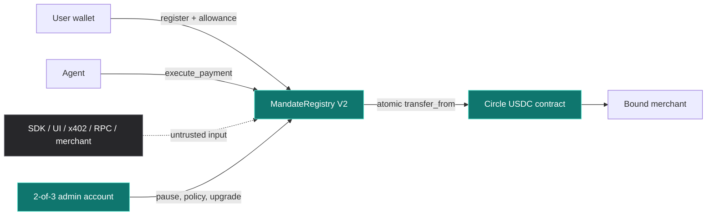
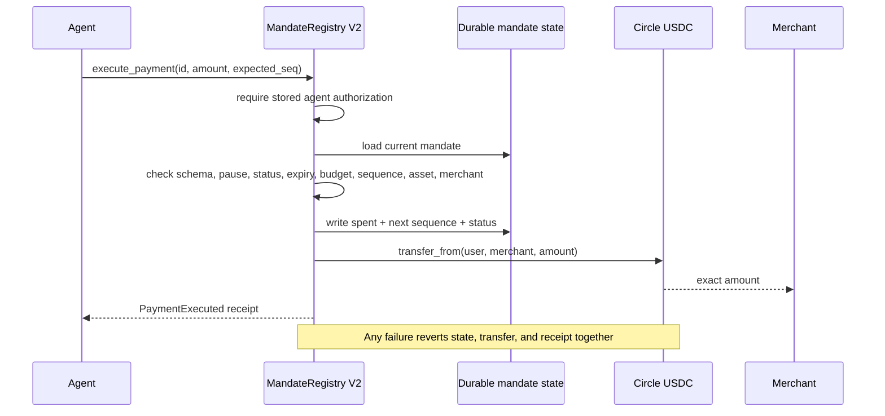
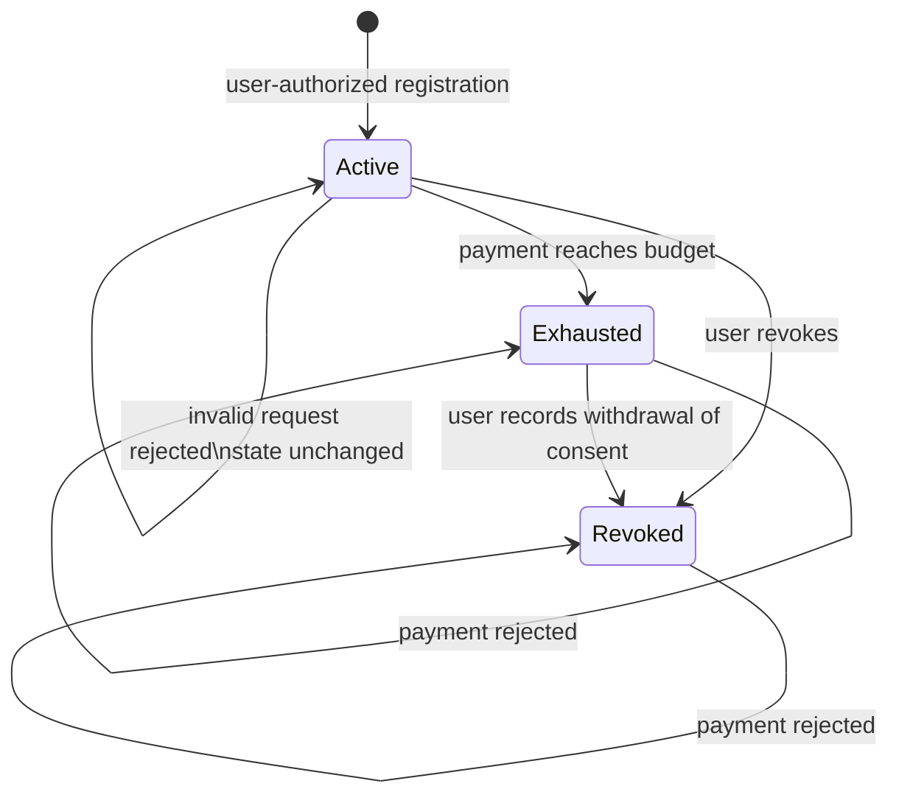

# Mainnet V2 security verification

**Gate check:** fresh local gate and canonical-artifact execution passed; CI runs on published changes

**Network:** Stellar Mainnet

**Verified on:** 2026-09-07 (Bangkok, UTC+7)

This is the reviewer entry point for T3 Step 2. It binds the security evidence
in this repository to the exact contract running on Mainnet.

## Result

| Requirement | Result | Evidence |
|---|---|---|
| Unauthorized callers | Pass | User, agent, administrator, successor-administrator, and hostile contract-principal rejection tests |
| Expired mandates | Pass | Before/at/after-expiry boundary checks |
| Overspend attempts | Pass | Single, cumulative, exact-budget, overflow, and exhausted-state checks |
| Replay attacks | Pass | Stale, future, and exhausted sequence checks with unchanged state |
| Unauthorized upgrades | Pass | Missing authority and wrong-principal rejection; upgrade also requires an already-paused contract |
| Every public function | Pass | All 18 exports mapped below; mutator authorization and appropriate public-read/constructor boundaries |
| Threat model and trust boundaries | Pass | [Current V2 threat model](mainnet-v2-threat-model.md) and [data entities/diagrams](mainnet-v2-data-flow.md) |
| Dependency and source gates | Pass with disclosed exception | Warnings-denied lint, actual workspace locks, advisory scan, interface/event locks, exact-WASM execution; [host-only maintenance exception](mainnet-v2-security-scan-report.md#dependency-scan) |
| Independent reproduction | Pass | One repository gate plus one dependency command |

## Exact Mainnet target

| Field | Verified value |
|---|---|
| Contract | [`CCLZEBJXG4YVJEPBCR5F27N733BCK5HQJWZZGB3K54JVODY3VAGP4HWR`](https://stellar.expert/explorer/public/contract/CCLZEBJXG4YVJEPBCR5F27N733BCK5HQJWZZGB3K54JVODY3VAGP4HWR) |
| WASM SHA-256 | `982809197d35d44c7b0fce6bd117fb2fec09b728c64c146c1f803b01faacff62` |
| Deployment transaction | [`28df0baa…61cd`](https://stellar.expert/explorer/public/tx/28df0baad437bde0409cebe002c528d3f6a3306dd1e0671a15fa1c4c47b961cd) |
| Administrator | `GCIURCX7JHEKQLRTW6RDZU7OJUVCDM7WWNQPIKRERIHQOHSLW7UY7TXG` |
| Authority policy | Exactly 3 Ed25519 signers, weight 1 each; thresholds `2/2/2` |
| Initial asset | Circle Stellar Mainnet USDC `CCW67TSZV3SSS2HXMBQ5JFGCKJNXKZM7UQUWUZPUTHXSTZLEO7SJMI75` |
| Live state | Pending administrator: none; schema: `2`; paused: `false`; USDC allowed: `true` |
| Interface | 18 functions; 9 typed events |

The chain checks above are read-only. No transaction was signed or submitted.
The test suite exercises both the current source and the downloaded canonical
optimized WASM whose hash is recorded on-chain. At this review, StellarExpert's
validation badge still reports `unverified`; the independent source/artifact/chain
hash evidence is not a claim that the explorer has issued a verification badge.

## Current threat model and data entities

- [Mainnet V2 threat model](mainnet-v2-threat-model.md): attacker capabilities,
  assumptions, asset protection, controls mapped to executable tests, and residual risks.
- [Mainnet V2 data flows](mainnet-v2-data-flow.md): instance and persistent keys,
  mandate/allowance/receipt entities, authorization, lifecycle, rollback, and relay boundary.
- [Mainnet V2 scan and findings record](mainnet-v2-security-scan-report.md): fresh
  results, verification weaknesses fixed, regression scenarios, and accepted exception.

These are the current deployed-V2 documents. The older `docs/security-*` files
remain historical evidence for a different Registry + TimelockController canary.

## What enforces a payment



The SDK cannot approve a payment. `execute_payment` repeats the authoritative
checks against current contract state, consumes budget and sequence, calls the
reviewed token, and emits the receipt in one Soroban transaction. A token
failure rolls back state and the receipt.

The recipient is the address bound into the mandate. In the hosted app this can
be a relay: its onward x402 seller payment and the seller's response are separate
operations, not an atomic guarantee made by MandateRegistry.



## Mandate lifecycle



## Public surface coverage

| Export | Accepted evidence | Rejected or boundary evidence |
|---|---|---|
| `__constructor` | Initial admin, schema, pause state, and USDC policy | Constructor-only host invariant |
| `get_admin` | Initial and rotated administrator | Preserved across failed and successful upgrade paths |
| `get_pending_admin` | Proposal and clear-on-accept | Empty state and replacement proposal |
| `propose_admin` | Two-step handoff | Missing authority and wrong principal |
| `accept_admin` | Candidate proves control | No proposal, missing authority, and wrong candidate |
| `pause` / `unpause` | Idempotent stop and recovery | Missing authority and wrong principal |
| `is_paused` | Initial, stopped, and restored states | Missing storage fails closed |
| `set_asset_allowed` | Paused policy update | Active-state call, missing authority, and wrong principal |
| `is_asset_allowed` | Initial and changed policy | Removed or unknown asset returns false |
| `get_schema_version` | Returns stored schema, including predecessor `1` | Missing schema returns an error; mandate read/write/payment methods reject any schema other than `2` |
| `upgrade` | Same-address replacement preserves state | Missing authority, wrong principal, and unpaused call |
| `derive_mandate_id` | Stable golden value | Registry, user, agent, merchant, asset, budget, expiry, and credential changes produce different IDs |
| `register_mandate` | Valid user-authorized mandate | Auth, duplicate credential, amount, expiry, lifetime, schema, and asset policy |
| `validate_mandate` | Current non-value preview | Unknown, pause, sequence, expiry, status, amount, budget, merchant, asset, and corrupt state |
| `execute_payment` | Exact atomic USDC movement | Auth, pause, replay, expiry, revocation, exhaustion, budget, allowance, callback, and corrupt state |
| `revoke_mandate` | User withdrawal of consent | Missing user authority and unknown mandate |
| `get_mandate` | Current stored state and TTL refresh | Unknown ID and incompatible schema |

Runtime assertions cover all nine event types: registration, payment,
revocation, pause, unpause, asset policy, administrator proposal,
administrator acceptance, and upgrade.

Read-only getters, ID derivation, and validation are intentionally public.
Inventing an unauthorized-caller rejection for a public preview would be an
incorrect test. Preview never authorizes execution. Constructor invocation is a
fresh-create host boundary, not a callable reinitialization or upgrade migration.
The [threat-model matrix](mainnet-v2-threat-model.md#attack-surfaces-controls-and-executable-evidence)
provides exact test names for each attack class; the required manifest prevents
silently deleting or renaming that executable surface.

## Gate evidence

| Gate | Recorded result |
|---|---|
| Native Soroban host tests | 52 passing |
| Exact optimized-WASM smoke | 1 passing |
| Required executable total | 53 |
| High-volume boundary lane | 10,001 consecutive signed amount values plus extreme integers |
| High-volume state lane | 512 full mandate scenarios with valid payment, replay rejection, exhaustion, and post-exhaustion rejection |
| Rust formatting and warnings-denied lint | Pass |
| Dependency advisory scan | 0 known vulnerabilities and 0 yanked crates in the actual root workspace lock used for V2 |
| Accepted host-only advisory | `RUSTSEC-2024-0436`; absent from the deployed `wasm32v1-none` graph and enforced by the gate |
| Scanner failure regressions | 13 scenarios passing, including partial/empty/failed resolution, wrong-lock prevention, and upstream exit-zero metadata errors |
| Authorization mutation checks | Both strengthened governance tests fail when upgrade authorization is removed; both fail when asset-policy authorization is removed; clean baseline/restored source pass |
| Hostile-agent budget mutation | A funded, sufficiently approved purchase above the mandate cap is rejected; removing the contract budget check makes the strengthened test fail |
| Artifact shape | 15,510 bytes; 18 functions; 9 events; locked interface hash |
| Source-to-chain binding | Canonical Linux SHA-256 equals the live contract code hash |

### Dated verification and review

- **2026-09-06 23:37:18–23:37:23 UTC:** final hardened advisory scan and all thirteen
  offline scanner scenarios passed. Exact scanner/database details are in the
  [scan record](mainnet-v2-security-scan-report.md).
- **23:25:28–23:25:57 UTC:** full repository gate passed after authorization and
  unknown-revocation test strengthening: 183 distinct tests / 235 executions
  across all variants; deployed V2 is 52 native tests plus one optimized-WASM test.
- **23:27:30 UTC:** canonical artifact downloaded from successful
  [CI run 34061497880](https://github.com/ackrate/ackrate-protocol-contracts/actions/runs/34061497880),
  source `7da1d795f2047bc59585749d412de422eacbd55f`, artifact `9997814846`.
  SHA-256, size, 18 functions, and nine events matched; those exact downloaded
  bytes passed the optimized enforcement smoke independently.
- **23:30 UTC:** isolated authorization mutations were caught for both direct
  missing-authority and wrong-contract-principal cases. Tests failed at the
  intended unauthorized-success assertions, not a build error, pause check, or
  invalid replacement hash. Restoring the original runtime restored passing tests.
- **23:36 UTC:** isolated budget-check removal was caught by the strengthened
  hostile-agent overspend test, with enough token funds and allowance for the
  otherwise-forbidden purchase. All five hostile-agent tests passed on baseline
  and restored code.
- **By 23:41:42 UTC:** final complete repository rerun passed with every
  remediation included: the hostile-agent fixture, authorization tests, and all
  thirteen scanner scenarios. Counts remain 183 distinct tests / 235 executions.

These timestamps are **2026-09-07 06:25–06:41 Bangkok**. The focused recheck uses
three independent review lanes plus an integrating reviewer, not thousands of
agents or a claim of external certification. Changes are to tests, scan gates,
and documentation; deployed runtime source is unchanged. CI enforces the
canonical hash again for the published revision containing these fixes.

## Reviewer reproduction

Use Rust `1.98.0` (including `rustfmt`, `clippy`, and `wasm32v1-none`), Stellar CLI
`27.0.0`, the pinned dependency scanner `0.22.2`, `jq`, and the locked dependencies
in the repository. The scan prints the exact installation instruction if its tool
is missing. The [CI workflow](../.github/workflows/ci.yml) contains pinned tool
setup and checksum verification for an independent clean Ubuntu environment.

```bash
./scripts/security-scan.sh
./scripts/gatecheck-contracts.sh
```

Run from the repository root. Do not substitute an unprepared all-feature test
command: the optimized smoke requires `MAINNET_V2_RELEASE_WASM`, which the full
gate builds, verifies, and supplies. The required manifest is compared to the
executable test list before execution. A tool, network, or dependency-resolution
failure means the gate did not pass.

The canonical byte-for-byte hash is enforced on Ubuntu in the repository gate.
A local platform build proves behavior, size, and interface but may not produce
the same file hash.

Key files:

- [`contracts/mainnet-v2/mandate-registry/src/lib.rs`](../contracts/mainnet-v2/mandate-registry/src/lib.rs) — complete enforcement surface
- [`contracts/mainnet-v2/mandate-registry/src/test.rs`](../contracts/mainnet-v2/mandate-registry/src/test.rs) — integration and negative paths
- [`contracts/mainnet-v2/mandate-registry/tests.required`](../contracts/mainnet-v2/mandate-registry/tests.required) — deletion-resistant test manifest
- [`scripts/gatecheck-contracts.sh`](../scripts/gatecheck-contracts.sh) — behavior, interface, event, and artifact gates
- [`scripts/security-scan.sh`](../scripts/security-scan.sh) — dependency policy
- [`scripts/test-security-scan.sh`](../scripts/test-security-scan.sh) — failure-path regressions for the scanner
- [`.github/workflows/ci.yml`](../.github/workflows/ci.yml) — continuous execution

## Governance and residual risk

V2 deliberately has **no timelock contract and no OpenZeppelin dependency**.
Its administrator is the native Stellar 2-of-3 account above. An upgrade needs
administrator authorization and an already-paused money path, but there is no
delay. This report must not be cited as evidence of a timelock.

Residual risks are explicit:

- two compromised custodian keys can authorize an administrator action;
- the same quorum can propose a successor that is not itself multisig;
- no delay exists between an authorized paused-state upgrade request and execution;
- host/RPC/wallet availability can interrupt a flow even though it cannot bypass contract checks; and
- this evidence is extensive testing and source-to-chain binding, not a formal proof that unknown defects do not exist.

Custodian identity, custody separation, rotation rehearsal, and key-loss
procedures require a private operating record and human attestation. This
software gate verifies public signer weights/thresholds and contract behavior;
it does not independently certify who controls each private key. The host-only
maintenance exception also remains disclosed, not represented as an upstream fix.
