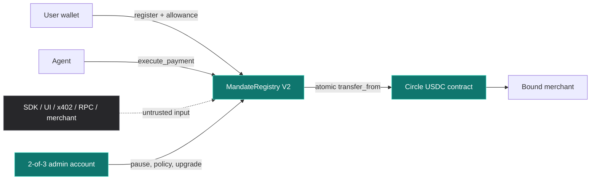
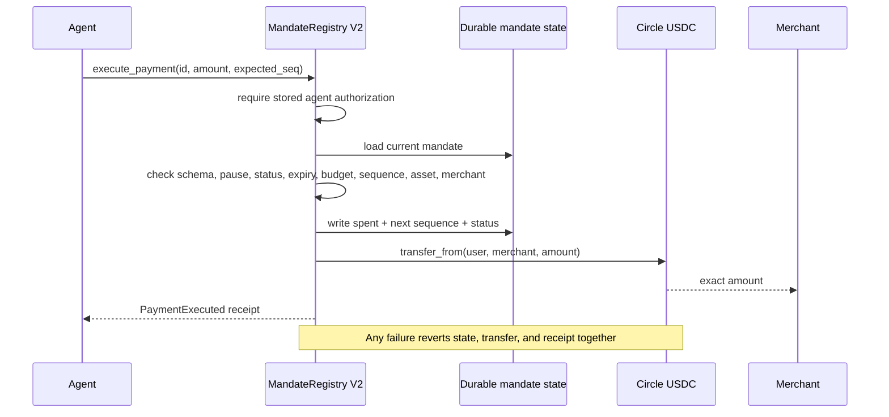
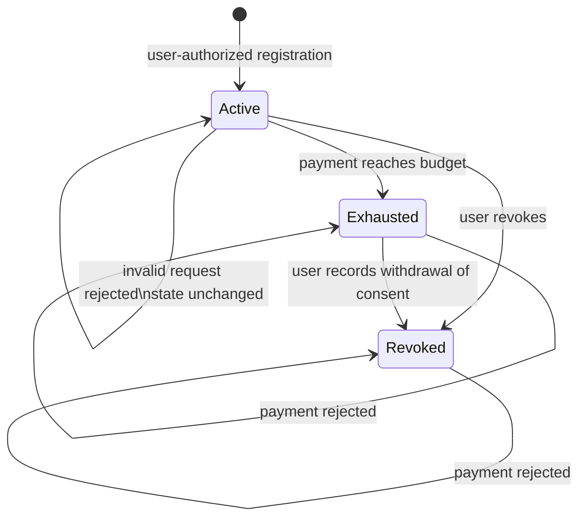

# Mainnet V2 security verification

**Gate check:** local gate passing; public CI executes on every published commit  
**Network:** Stellar Mainnet  
**Verified on:** 2026-09-01

This is the reviewer entry point for T3 Step 2. It binds the security evidence
in this repository to the exact contract running on Mainnet.

## Result

| Requirement | Result | Evidence |
|---|---|---|
| Unauthorized callers | Pass | User, agent, administrator, successor-administrator, and hostile contract-principal rejection tests |
| Expired mandates | Pass | Before/at/after-expiry boundary checks |
| Overspend attempts | Pass | Single, cumulative, exact-budget, overflow, and exhausted-state checks |
| Replay attacks | Pass | Stale, future, and exhausted sequence checks with unchanged state |
| Unauthorized upgrades | Pass | Missing authority and wrong-principal rejection; upgrade also requires an already-paused contract |
| Every public function | Pass | All 18 exports mapped below; every mutator has accepted and rejected evidence |
| Threat model and trust boundaries | Pass | Diagrams and residual risks below |
| Dependency and source gates | Pass | Warnings-denied lint, locked dependencies, advisory scan, interface lock, event lock, and exact-WASM execution |
| Independent reproduction | Pass | One repository gate plus one dependency command |

## Exact Mainnet target

| Field | Verified value |
|---|---|
| Contract | [`CCLZEBJXG4YVJEPBCR5F27N733BCK5HQJWZZGB3K54JVODY3VAGP4HWR`](https://stellar.expert/explorer/public/contract/CCLZEBJXG4YVJEPBCR5F27N733BCK5HQJWZZGB3K54JVODY3VAGP4HWR) |
| WASM SHA-256 | `982809197d35d44c7b0fce6bd117fb2fec09b728c64c146c1f803b01faacff62` |
| Deployment transaction | [`28df0baa…61cd`](https://stellar.expert/explorer/public/tx/28df0baad437bde0409cebe002c528d3f6a3306dd1e0671a15fa1c4c47b961cd) |
| Administrator | `GCIURCX7JHEKQLRTW6RDZU7OJUVCDM7WWNQPIKRERIHQOHSLW7UY7TXG` |
| Authority policy | Exactly 3 Ed25519 signers, weight 1 each; thresholds `2/2/2` |
| Initial asset | Circle Stellar Mainnet USDC `CCW67TSZV3SSS2HXMBQ5JFGCKJNXKZM7UQUWUZPUTHXSTZLEO7SJMI75` |
| Live state | Pending administrator: none; schema: `2`; paused: `false`; USDC allowed: `true` |
| Interface | 18 functions; 9 typed events |

The chain checks above are read-only. No transaction was signed or submitted.
The test suite exercises the same source and exact optimized WASM whose hash is
recorded on-chain.

## What enforces a payment



The SDK cannot approve a payment. `execute_payment` repeats the authoritative
checks against current contract state, consumes budget and sequence, calls the
reviewed token, and emits the receipt in one Soroban transaction. A token
failure rolls back state and the receipt.



## Mandate lifecycle



## Public surface coverage

| Export | Accepted evidence | Rejected or boundary evidence |
|---|---|---|
| `__constructor` | Initial admin, schema, pause state, and USDC policy | Constructor-only host invariant |
| `get_admin` | Initial and rotated administrator | Preserved across failed and successful upgrade paths |
| `get_pending_admin` | Proposal and clear-on-accept | Empty state and replacement proposal |
| `propose_admin` | Two-step handoff | Missing authority and wrong principal |
| `accept_admin` | Candidate proves control | No proposal, missing authority, and wrong candidate |
| `pause` / `unpause` | Idempotent stop and recovery | Missing authority and wrong principal |
| `is_paused` | Initial, stopped, and restored states | Missing storage fails closed |
| `set_asset_allowed` | Paused policy update | Active-state call, missing authority, and wrong principal |
| `is_asset_allowed` | Initial and changed policy | Removed or unknown asset returns false |
| `get_schema_version` | Schema `2` | Missing or predecessor schema fails closed |
| `upgrade` | Same-address replacement preserves state | Missing authority, wrong principal, and unpaused call |
| `derive_mandate_id` | Stable golden value | Registry, user, agent, merchant, asset, budget, expiry, and credential changes produce different IDs |
| `register_mandate` | Valid user-authorized mandate | Auth, duplicate credential, amount, expiry, lifetime, schema, and asset policy |
| `validate_mandate` | Current non-value preview | Unknown, pause, sequence, expiry, status, amount, budget, merchant, asset, and corrupt state |
| `execute_payment` | Exact atomic USDC movement | Auth, pause, replay, expiry, revocation, exhaustion, budget, allowance, callback, and corrupt state |
| `revoke_mandate` | User withdrawal of consent | Missing user authority and unknown mandate |
| `get_mandate` | Current stored state and TTL refresh | Unknown ID and incompatible schema |

Runtime assertions cover all nine event types: registration, payment,
revocation, pause, unpause, asset policy, administrator proposal,
administrator acceptance, and upgrade.

## Gate evidence

| Gate | Recorded result |
|---|---|
| Native Soroban host tests | 52 passing |
| Exact optimized-WASM smoke | 1 passing |
| Required executable total | 53 |
| High-volume boundary lane | 10,001 consecutive signed amount values plus extreme integers |
| High-volume state lane | 512 full mandate scenarios with valid payment, replay rejection, exhaustion, and post-exhaustion rejection |
| Rust formatting and warnings-denied lint | Pass |
| Dependency advisory scan | 0 known vulnerabilities and 0 yanked crates in the V2 lockfile |
| Accepted host-only advisory | `RUSTSEC-2024-0436`; absent from the deployed `wasm32v1-none` graph and enforced by the gate |
| Artifact shape | 15,510 bytes; 18 functions; 9 events; locked interface hash |
| Source-to-chain binding | Canonical Linux SHA-256 equals the live contract code hash |

## Reviewer reproduction

Use Rust `1.98.0`, Stellar CLI `27.0.0`, and the pinned dependencies in the
repository.

```bash
./scripts/security-scan.sh
./scripts/gatecheck-contracts.sh
```

The canonical byte-for-byte hash is enforced on Ubuntu in the repository gate.
A local platform build proves behavior, size, and interface but may not produce
the same file hash.

Key files:

- [`contracts/mainnet-v2/mandate-registry/src/lib.rs`](../contracts/mainnet-v2/mandate-registry/src/lib.rs) — complete enforcement surface
- [`contracts/mainnet-v2/mandate-registry/src/test.rs`](../contracts/mainnet-v2/mandate-registry/src/test.rs) — integration and negative paths
- [`contracts/mainnet-v2/mandate-registry/tests.required`](../contracts/mainnet-v2/mandate-registry/tests.required) — deletion-resistant test manifest
- [`scripts/gatecheck-contracts.sh`](../scripts/gatecheck-contracts.sh) — behavior, interface, event, and artifact gates
- [`scripts/security-scan.sh`](../scripts/security-scan.sh) — dependency policy
- [`.github/workflows/ci.yml`](../.github/workflows/ci.yml) — continuous execution

## Governance and residual risk

V2 deliberately has **no timelock contract and no OpenZeppelin dependency**.
Its administrator is the native Stellar 2-of-3 account above. An upgrade needs
administrator authorization and an already-paused money path, but there is no
delay. This report must not be cited as evidence of a timelock.

Residual risks are explicit:

- two compromised custodian keys can authorize an administrator action;
- the same quorum can propose a successor that is not itself multisig;
- no delay exists between an authorized paused-state upgrade request and execution;
- host/RPC/wallet availability can interrupt a flow even though it cannot bypass contract checks; and
- this evidence is extensive testing and source-to-chain binding, not a formal proof that unknown defects do not exist.

Custodian identity, rotation, and key-loss procedures are maintained in the
private operating record; public chain state proves the signer weights and
thresholds without publishing private custody details.
