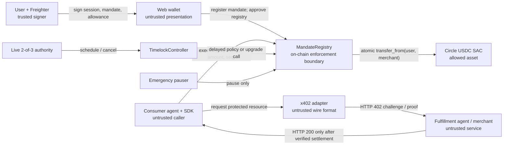
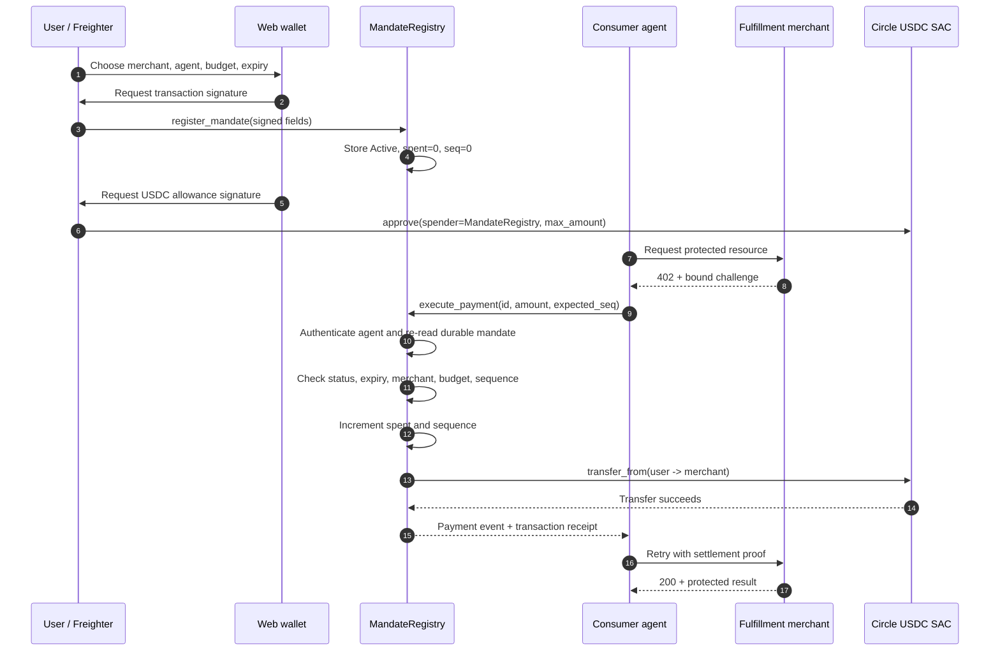
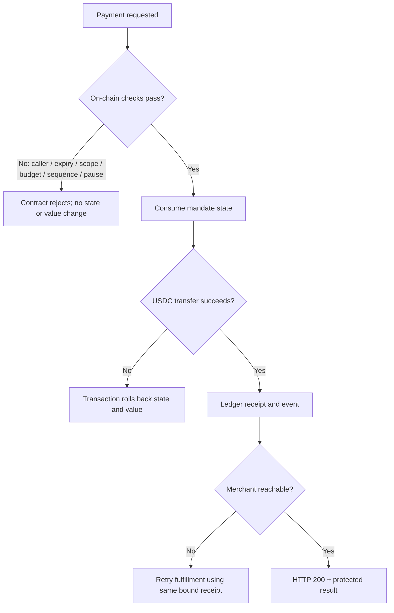
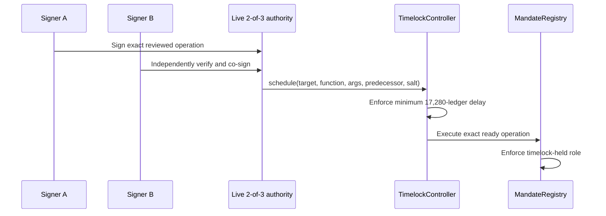

# Mainnet security data flow

Status: release gate
Last reviewed: 2026-08-27

## System and trust boundaries

The boundary is the registry transaction, not the SDK call and not the HTTP
exchange. Replacing x402 v0.1 with a later request/response shape does not
change the mandate schema or the payment invariant.

The live canary already uses the technical 2-of-3 authority shown in the
deployment manifest. The remaining step is the independent physical Freighter
custody handoff; it is tracked separately from the on-chain signer math.

## Mandate lifecycle and payment

All state consumption and value movement are atomic. If authorization,
validation, sequence comparison, allowance, or token transfer fails, Soroban
reverts the complete invocation.

## State entities

| Entity | Authoritative fields | Writer | Reader |
|---|---|---|---|
| Mandate | user, agent, merchant, asset, max amount, spent, expiry, sequence, status, credential hash | Registry | Registry; public clients for inspection |
| Asset policy | asset address -> allowed | Timelock-authorized registry call | Registry registration path |
| Pause state | boolean | Pauser / unpauser roles | Registry payment path |
| Timelock operation | target, function, args, predecessor, salt, ready ledger, state | Live 2-of-3 proposer; controller | Controller execution path; public observers |
| USDC allowance | owner, spender=registry, amount, expiry ledger | User signature | Circle USDC SAC during transfer |
| Settlement receipt | transaction hash, registry event, token transfer, mandate ID, sequence | Stellar ledger | Merchant verifier and reviewer |
| x402 challenge | method, resource, merchant, asset, amount, nonce/expiry | Merchant adapter | Consumer and fulfillment adapter only; never contract authority |

## Failure flows

Required live drills document four user-visible outcomes: a normal payment, an
agent operating within its budget, merchant downtime after settlement with
idempotent recovery, and an expired or exhausted mandate rejected without a
transfer.

## Governance flow

The emergency pauser is intentionally outside this sequence and can only stop
the money path. It cannot restore service, alter asset policy, or replace WASM.
